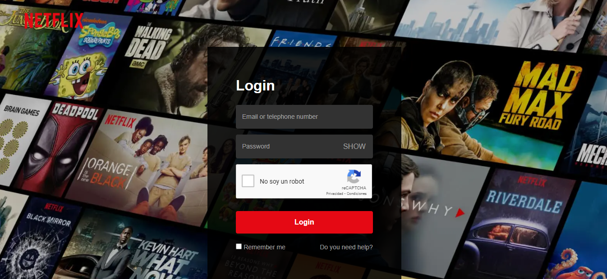
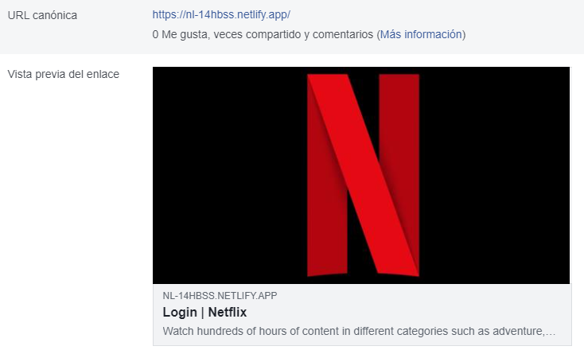
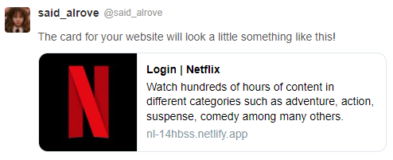

# [netflix-login](https://nl-14hbss.netlify.app/)
This is the sixth project from Juan Pablo's course of [CSS Grid and Flexbox](https://www.udemy.com/course/css-grid-y-flexbox-la-guia-definitiva-crea-10-proyectos/).

> **Disclaimer:** I'm starting to learn how to use **Git/Github** correctly, therefore there'll be plenty of pull requests, commits and other stuff as tests in this repository, however, *this won't represent my way of working forever*, I'll learn more things along the way as always :D!.

## Table of contents
* [Preview](#preview)
* [What I learned](#what-i-learned)
* [Open Graph](#open-graph)
    - [Facebook](#facebook)
    - [Twitter](#twitter)

## What I learned

## Preview

## Open Graph

### Facebook

### Twitter

