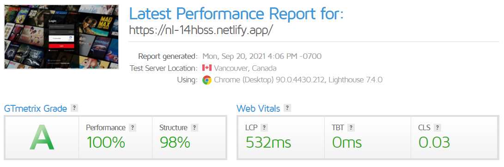
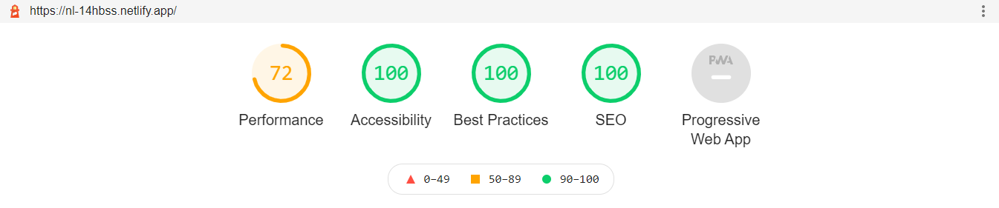

# [netflix-login](https://nl-14hbss.netlify.app/)
This is the sixth project from Juan Pablo's course of [CSS Grid and Flexbox](https://www.udemy.com/course/css-grid-y-flexbox-la-guia-definitiva-crea-10-proyectos/).

> **Disclaimer:** I'm starting to learn how to use **Git/Github** correctly, therefore there'll be plenty of pull requests, commits and other stuff as tests in this repository, however, *this won't represent my way of working forever*, I'll learn more things along the way as always :D!.

## Table of contents
* [Preview](#preview)
* [What I learned](#what-i-learned)
* [Reports](#reports)
    - [GTmetrix](#gtmetrix)
    - [Lighthouse](#lighthouse)
* [Open Graph](#open-graph)
    - [Facebook](#facebook)
    - [Twitter](#twitter)

## What I learned
* Have passed a while since I upload the [last project](https://github.com/said-alrove/masonry-layout) and that's because I spent a few days learning all that I needed for setting up my project with [Gulp](https://gulpjs.com/) and to be honest that has been the best desition that I've ever taken. I learned how to create tasks and export them, furthermore, I figured out that I can modularize the Gulpfile into different Javascript files, in my case I decided to separate the files into categories (like styles, images, scripts, and HTML for example).

    These are some plugins that I used during this project and that I consider very useful:

    - [Gulp-webp](https://www.npmjs.com/package/gulp-webp) to convert images into WebP.
    - [Gulp-postcss](https://www.npmjs.com/package/gulp-postcss) to use PostCSS plugins (such as [autoprefixer](https://www.npmjs.com/package/autoprefixer) and [cssnano](https://www.npmjs.com/package/cssnano))
    - [Gulp-purgecss](https://www.npmjs.com/package/gulp-purgecss) to remove blocks of styles from the stylesheets when they're not affecting any element in the HTMl files.

    > **Note:** this plugin could be some tricky when injecting CSS classes into the HTML from Javascript because those are classes that aren't present when building the production version, thus PurgeCSS will remove those classes from the stylesheets, therefore to avoid this I made a "hack" which is to add and HTML element with all the classes that you'll inject from Javascript but with a hidden helper class (that way it doesn't affect the layout flow).

    - [Gulp-cache-bust](https://www.npmjs.com/package/gulp-cache-bust) to give to the Js and CSS sources a unique ID in the HTML every time you modify those files and that way avoid that the browser doesn't load new changes (this is because the browser caches the files and sometimes doesn't load new changes because it thinks that the files haven't changed due to the name of the files keep the same).

    > **Note:** the reason I wanted to learn Gulp is that there were some repetitive tasks that I did almost every time I made a project such as optimizing images, convert images to Webp and Avif, write large commands to compile SASS files to CSS stylesheets with a certain configuration, furthermore of other tasks that were almost impossible to do without a tool like Gulp. Now I can have a better workflow with more possibilities of optimization.

* I also learned how to create a basic Netflify config file to tell it how to build the site when deploying (by now I only know how to set the base and publish directory and the commands needed for build the site).

* Furthermore, related to Netlify, I learned how to connect a form with Netlify and that way to receive the information of it to the Netlify dashboard of the page or to my email without having to write any backend or database, which I found very useful. Here are some links to understand what I'm talking about:

    - [Forms setup](https://docs.netlify.com/forms/setup/)
    - [Spam filters](https://docs.netlify.com/forms/spam-filters/)

* Of course I continued learning more about Git and this time I learned a few very useful commands such as:

    - **Git commit** command followed by the **- amend** flag to add changes to the last commit.

        > **Note:** here you can add the **- m** subcommand to edit also the message of the last commit, or the **- no-edit** flag to just add changes to the last commit without editing the commit's message. Have in mind that the commit's log will change, therefore you must not amend a commits that's already public.

    - **Git rebase** command followed by the name of the branch you'd like to rebase, this way you can bring the changes of one branch onto another without having a "merge commit" in your project's history, this allows you to have a cleaner and linear project's history.

        > **Note:** for more information I further recommend this lecture: [Merging vs. Rebasing](https://www.atlassian.com/git/tutorials/merging-vs-rebasing).

    - **Git rebase** command followed by **- i** flag and the name of the branch you'd like to rebase with the number of commits you'd like to edit (master~5, for example), this one is similar to the previus command, the difference is that here you can have more control over WHAT changes and HOW you'll bring them. 

        > **Note:** git bash will open your default text editor and there it'll show you the number of commits you requested starting from the latest commit among the ones you brought, there you'll be able to add different commands for specifically do something with the different commits such as:

        - **Pickup** to keep the commit as it is.
        - **Drop** to remove the commit.
        - **Fixup** to meld the commit with the previous one (the commit's message that will be preserved is the previous one too, if you'd like to edit it you have to use the **-c** or **-C** subcommands, the difference between them is that **-c** will allow you to edit the commit's message from the command line, and **-C** will open the text editor again).
        - **Edit** to stop at that commit while rebasing to amend.
        - **Reword** to edit the commit's message of that commit.

        > **Note:** there are also a few others that are a little bit less important from my perspective. I have to mention that all of them have their respective abbreviation such as **p** for pickup, **d** for drop, **f** for fixup, **e** for edit, or **r** for reword.
        
        > **Note:** git rebase also have three very important commands when the rebasing is in process. 

        - If you are having a merging conflict because both branches have modified the same file, you can fix it, add it to the staging, and then use the **git rebase** command followed by the **--continue** flag to continue the rebasing.
        - If you're having a merging conflict or if you decided to stop at a specific commit when rebasing interactively and you realize that you don't really need the commit in your project's history you can use the **git rebase** command followed by the **--skip** flag.
        - If you'd like to cancel the rebase, you can use the **git rebase** command followed by the **--abort** flag.

    - **Git push** command followed by the **-u** flag (which is an abbreviation for **--set-upstream**) and the repository and branch where you'd like to send the changes, that way you can push the commits at the same time that you're setting an upstream for that branch which will allow you to push commits in the future without having to specify the repository and branch.

        > **Note:** once you've setup the upstream you won't have to specify the repository and branch for a lot of commands such as **pull** or **fetch**.

    - **Git branch** command followed by the **-u** flag (which is an abbreviation for **--set-upstream**) and the repository and branch that you'd like to have as a reference, this is very similar to the previous one but here the syntax for the upstream is different (**repository/branch** instead of **repository branch**) and this time you're not pushing commits, you're just setting the upstream branch.

    - **Git checkout** followed by the **--track** flag and the repository with the branch where you'd like to bring to your local machine, that way you can create a branch that already exists remotely but not locally and it'll automatically have the upstream set.

    - **Git tag** command followed by the name of the tag (which will be associated with the current commit), that way you can create a tag that will be a pointer to a determinated commit. You can also associate the tag to a later commit by writing the SHA code at the end.

        > **Note:** there are two different kinds of tags, the annotated tags and the unannotated ones, the difference between them is the first ones will only contain the name of the tag and the commit's SHA code it's associated to, in the second case we have the opportunity to write a message (with the **-m** flag followed by the summary) to describe what that tag is about, obviously there's more than just this explication, therefore if you'd like to read more about this [check this lecture](https://stackoverflow.com/questions/11514075/what-is-the-difference-between-an-annotated-and-unannotated-tag).

* I don't start learning Javascript yet, however, I tried to at least understand the script used in this project for the validation of the formulation (as a comment, I'd like to mention that the course, as you may guess, isn't about Javascript at all, but the instructor tries to introduce us to technologies that we'll use in the future in our learning path such as, in this case, Javascript, therefore, in theory, it's okay to don't understand that part of the project completely).

* As the last thing I'd like to add that I was planning to learn at least the basics of [Tailwind](https://tailwindcss.com/) to apply it to this project, but I started with Gulp first and it took me a considerable time to finally feel confident with it, therefore I decided to wait for a few projects before even start to use Tailwind (to learn it in deep) and just upload this project that has been on hold for a while.

> **Note:** as always I'd like to add the lectures that I've had along the way when building this project and that helped me to understand a few concepts or to just increase my knowledge about something that might be alien to this project in specific but that could be still related to the programming area:

- [[Icon Request] Gulp folder](https://gitmemory.com/issue/PKief/vscode-material-icon-theme/463/770114473)
- [Struggling with Gulpfile](https://forum.freecodecamp.org/t/struggling-with-gulpfile/271477)
- [Javascript modules](https://developer.mozilla.org/en-US/docs/Web/JavaScript/Guide/Modules)
- [How to set upstream branch on Git](https://devconnected.com/how-to-set-upstream-branch-on-git/)
- [How to delete local and remote tags on Git](https://devconnected.com/how-to-delete-local-and-remote-tags-on-git/)
- [Get started with build configuration](https://docs.netlify.com/configure-builds/get-started/?_ga=2.51433645.549895652.1631406158-753793176.1629309174#build-settings)
- [Custom domains](https://docs.netlify.com/domains-https/custom-domains/?_ga=2.39254567.549895652.1631406158-753793176.1629309174)
- [[Support Guide] What if my project folder is not the root of my git repository?](https://answers.netlify.com/t/support-guide-what-if-my-project-folder-is-not-the-root-of-my-git-repository/123)
- [What does this mean: TypeError: dest.on is not a function](https://stackoverflow.com/questions/55547794/what-does-this-mean-typeerror-dest-on-is-not-a-function)
- [Git Fetch vs Pull: What's the Difference Between the Git Fetch and Git Pull Commands?](https://www.freecodecamp.org/news/git-fetch-vs-pull/#)
- [How do you rename a tag in Git](https://stackoverflow.com/questions/1028649/how-do-you-rename-a-git-tag)
- [How to resize the Google noCAPTCHA reCAPTCHA](https://geekgoddess.com/how-to-resize-the-google-nocaptcha-recaptcha/)
- [A Complete Guide to Netlify Forms](https://www.stackbit.com/blog/complete-guide-netlify-forms/)
- [Why isn't my tag listed when I checkout with Git GUI?](https://stackoverflow.com/questions/49283734/why-isnt-my-tag-listed-when-i-checkout-with-git-gui)
- [Requiring modules in Node.js: Everything you need to know](https://www.freecodecamp.org/news/requiring-modules-in-node-js-everything-you-need-to-know-e7fbd119be8/)
- [Node.js, TC-39, and Modules](https://hackernoon.com/node-js-tc-39-and-modules-a1118aecf95e)
- [An Update on ESM 6 Modules on Node.js](https://medium.com/the-node-js-collection/an-update-on-es6-modules-in-node-js-42c958b890c)
- [La diferencia entre "require (x)" e import x](https://www.it-swarm-es.com/es/node.js/la-diferencia-entre-require-x-e-import-x/833940468/)
- [Git interactive rebase no commits to pick](https://stackoverflow.com/questions/6485508/git-interactive-rebase-no-commits-to-pick)
- [Merging vs. Rebasing](https://www.atlassian.com/git/tutorials/merging-vs-rebasing)
- [Git rebase](https://www.atlassian.com/git/tutorials/rewriting-history/git-rebase)
- [How to remove files from git staging area](https://stackoverflow.com/questions/19730565/how-to-remove-files-from-git-staging-area)

## Preview

## Reports

### GTmetrix

### Lighthouse

## Open Graph

### Facebook

### Twitter

